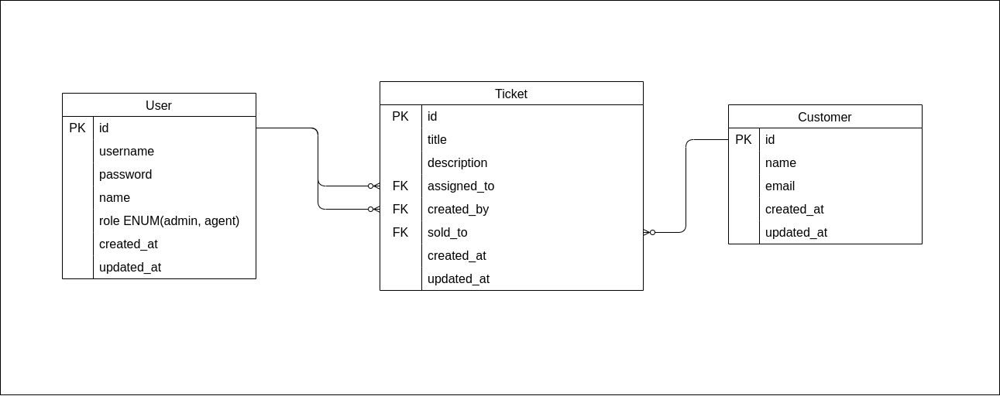

# Support Tickets

- [Support Tickets](#support-tickets)
  - [Includes](#includes)
  - [How To Run](#how-to-run)
    - [Docker](#docker)
    - [Python](#python)
  - [Tests](#tests)
  - [Seeding](#seeding)
  - [Documentation](#documentation)
    - [ERD Diagram](#erd-diagram)
    - [Postman Collection](#postman-collection)

## Includes

1. Admin Endpoints
2. Support Agent Endpoints
3. Session Authentication
4. Role Guards
5. Single Table Inheritance
6. Table Row Locking *(to avoid race conditions)*
7. Tests
8. Postman Collection
9. ERD Diagram
10. Containerization
11. seeder

## How To Run

### Docker
The easiest and fastest way is using docker. All you need is to have docker installed on your machine.

For development, use `docker-compose.dev.yml`. If you just want to run the app, you can use `docker-compose.yml`.


`for development:`
```bash
# includes a bind mount to watch for changes in the code
# and includes pgAdmin running on port 15433
docker compose -f docker-compose.dev.yml up --build
```

`for just running the app:`
```bash
# the database is automatically seeded so you can test the endpoints
docker compose up --build
```

You can access the app on `http://localhost:8000` and pgAdmin on `http://localhost:15433` *(if you are running `docker-compose.dev.yml`)*.

The default credentials for pgAdmin are:
- email: `admin@app.com`
- password: `admin`

### Python
If you don't want to use docker, you can run the app using python. You need to have python 3.8 or higher installed on your machine.
```bash
# create a virtual environment
python -m venv env

# activate the virtual environment
# on windows
env\Scripts\activate
# on macOS and Linux
source env/bin/activate

# install the dependencies
pip install -r requirements.txt

# create a .env (rename .env.example to .env)
# on windows
copy .env.example .env
# on macOS and Linux
cp .env.example .env

# run the migrations
python manage.py migrate

# run the application
python manage.py runserver
```

if you use the example `.env` file. You will be using a SQLite database. Keep in mind that table row locking will not work with SQLite. You can use PostgreSQL or MySQL instead. Change the database configuration in the `.env` file to use PostgreSQL or MySQL.

## Tests
You can run the tests using the `test` command. 
```bash
# run the tests
python manage.py test

# or specify a specific test
python manage.py test agents_console.test_tickets_concurrency
```

If you want to run the tests using docker, you can use the following command:
```bash
# run the tests
docker compose run web python manage.py test
```

## Seeding
The seeder will clear the tables first, then will add the data.

To run the seeder, you can use the following command:
```bash
python manage.py seed_all

# or using docker
docker compose run web python manage.py seed_all
```

## Documentation
### ERD Diagram


### Postman Collection
You can find the postman collection in the `docs` folder. You can import it to postman and test the endpoints. [Postman Collection](./docs/Tickets.postman_collection.json)